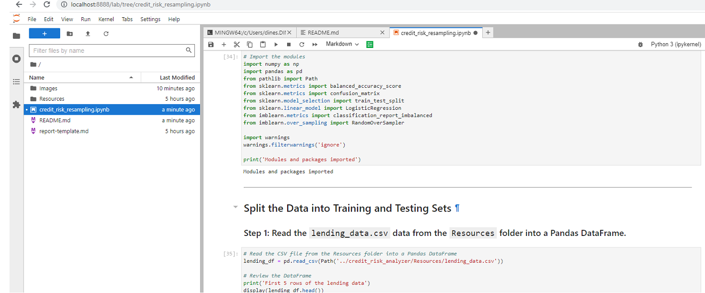
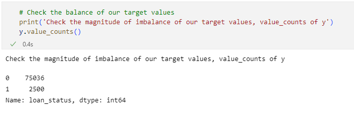
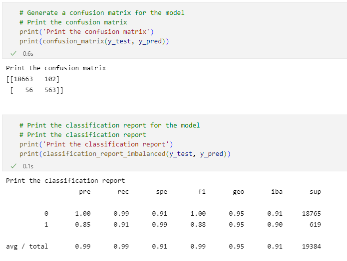
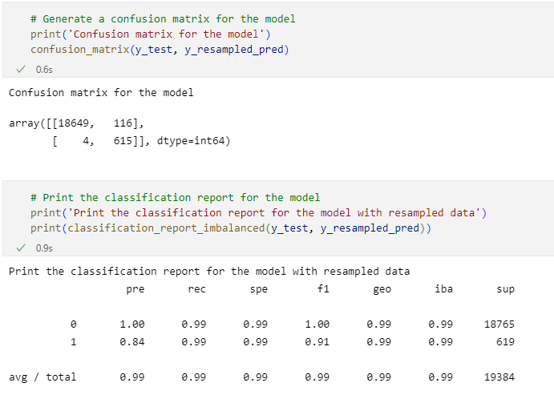

# Credit Risk Analyzer
Credit Risk Analyzer is a Python program which uses a machine learning algorithm to solve credit risk problem in a typical peer-to-peer lending financial industry. Credit risk poses a classification problem that’s inherently imbalanced. This is because healthy loans easily outnumber risky loans. Using a dataset of historical lending activity from a peer-to-peer lending services company, we will demonstrate with two separate Logistic Regression Models based on the original imbalanced data and the resampled data, to predict and identify the creditworthiness of loan profiles.  We will apply resampling techniques to enhance a model’s performance for imbalanced data. We’ll predict which loans to consider at risk vs. which to consider not at risk. The at-risk loans will make up only a small portion of all the data, which is often challenging when creating Logistic Regression model to predict possible high-risk loans.

The analysis is done in the following order.

* Step 1: Split the Data into Training and Testing Sets
* Step 2: Create a Logistic Regression Model with the Original Data
* Step 3: Predict a Logistic Regression Model with Resampled Training Data
* Step 4: Prepare a Credit Risk Analysis Report

The steps above will follow a typical ***model-fit-predict-evaluate*** pattern of implementing a machine learning algorithm in Python.

---

## Technologies

This project leverages python 3.7.* with the following additional packages:
* [Jupyter Notebook](https://jupyter.org/) - The Credit Risk Analyzer is written in the Jupyter Notebook.
* [Conda](https://docs.conda.io/projects/conda/en/latest/) - Conda environment is recommended to have Pandas library and other dependencies pre-installed.

**Required Libraries:**

You may need the following key libraries to work with the program.

- [Pandas](https://pandas.pydata.org/docs/reference/index.html) - pandas is a Python package providing fast, flexible, and expressive data structures designed to make working with “relational” or “labeled” data both easy and intuitive.
- [imbalanced-learn](https://pypi.org/project/imbalanced-learn/) - imbalanced-learn is a python package offering a number of re-sampling techniques commonly used in datasets showing strong between-class imbalance.
- [scikit-learn](https://scikit-learn.org/stable/getting_started.html/) - Scikit-learn is an open source machine learning library that supports supervised and unsupervised learning.

---

## Usage

To use the Credit Risk Analyzer application, clone the repository in your local workspace. From the Git Bash terminal, make sure to 'activate conda' and appropriate virtual enivorment. Next, launch the JupyterLab web-based interactive development environment (IDE) interface by typing at the prompt:

```python
  > jupyter lab
```
Next, open **credit_risk_resampling.ipynb** in a Jupyter Notebook web console. See the image below for a quick hint.



---

**Magnitude of Imbalance in the target y value**



---

**The confusion matrix and classification report of the imbalanced data model show output as:**



---

**The confusion matrix and classification report of the resampled data model show output as:**



---

## Credit Risk Analysis Report
Credit Risk Analyzer program runs against the original imbalanced lending data and resample lending data using the Logistic Regression machine learning algorithm.

**An Overview of the Analysis**

In a typical peer-to-peer lending financial service industry, credit risk poses a classification problem that’s inherently imbalanced. This is because healthy loans easily outnumber risky loans. Using a dataset of historical lending activity from a peer-to-peer lending services company, the program demonstrates two separate Logistic Regression Models based on the original imbalanced data and the resampled data, to predict and identify the creditworthiness of loan profiles. The program will apply resampling techniques to enhance a model’s performance for imbalanced data. The program then predicts which loans to consider at risk vs. which to consider not at risk. The at-risk loans will make up only a small portion of all the data, which is often challenging when creating Logistic Regression model to predict possible high-risk loans.

The program aims to solve the typical imbalanced data type of Classification problem and provide the recommendation of the appropriate Logistic Regression model for credit risk analysis. 

**The Results**

Referring to the results of confusion matrix and classification report of both the models above, we have following findings about the machine learning models created in the program.

- The higher percentage values of Precision (100%) and Recall (99%) show the biasedness of the both the models towards the majority class ('0' healthy loans).
- The reliability of positive classification is pretty high looking at the Precision values (100% for '1' TPs and relatively less FPs of 85% for '1') in imbalanced data model.

- The balanced_accuracy_score of oversampled data is higher than that of original data based logistic regression model (0.9936781215845847 vs. 0.9520479254722232). But it can be misleading at this stage to conclude the better performance of oversampled data model until we compare precision and recall scores too.

- Comparing the two models with the precision for the 1 class - The model that used the imbalanced data produced a precision of 0.85. The model that used the oversampled data produced a precision of 0.84. So, the logistic regression model that used the original data did slightly better at making predictions for the 1 class (high-risk loan).
- Comparing the two models with the recall for the 1 class - The model that used the imbalanced data produced a recall of 0.91. The model that used the oversampled data produced a recall of 0.99. So, the model that used the oversampled data was dramatically more accurate at predicting high risk loans. That is, if we compare 612.81 ('support value' 619 * 0.99) to 615 (TNs in the confusion matrix), it looks the oversampled data model will predict True Negative close to 615 better than the model with original data.

**Summary**

Referring to the results of confusion matrix and classification report of both the models above, the findings can be summarized as below.
- The higher percentage values of Precision (100%) and Recall (99%) show the biasedness of the model towards the majority class ('0' healthy loans). 
- The balanced_accuracy_score of oversampled data is higher than that of original data based logistic regression model (0.9936781215845847 vs. 0.9520479254722232). But it can be misleading at this stage to conclude the better performance of oversampled data model until we compare precision and recall scores too.
- Comparing the two models with the precision for the 1 class - The model that used the imbalanced data produced a precision of 0.85. The model that used the oversampled data produced a precision of 0.84. So, the logistic regression model that used the original data did slightly better at making predictions for the 1 class (high-risk loan).
- Comparing the two models with the recall for the 1 class - The model that used the imbalanced data produced a recall of 0.91. The model that used the oversampled data produced a recall of 0.99. So, the model that used the oversampled data was dramatically more accurate at predicting high risk loans. That is, if we compare 612.81 ('support value' 619 * 0.99) to 615 (TNs in the confusion matrix), it looks the oversampled data model will predict True Negative close to 615 better than the model with original data.

Hence, **oversampled data model** is recommended, as our objective is to identify more accurately high-risk loans to customers.

---

## Contributors

FinTech Labs, Inc.

---

## License

None